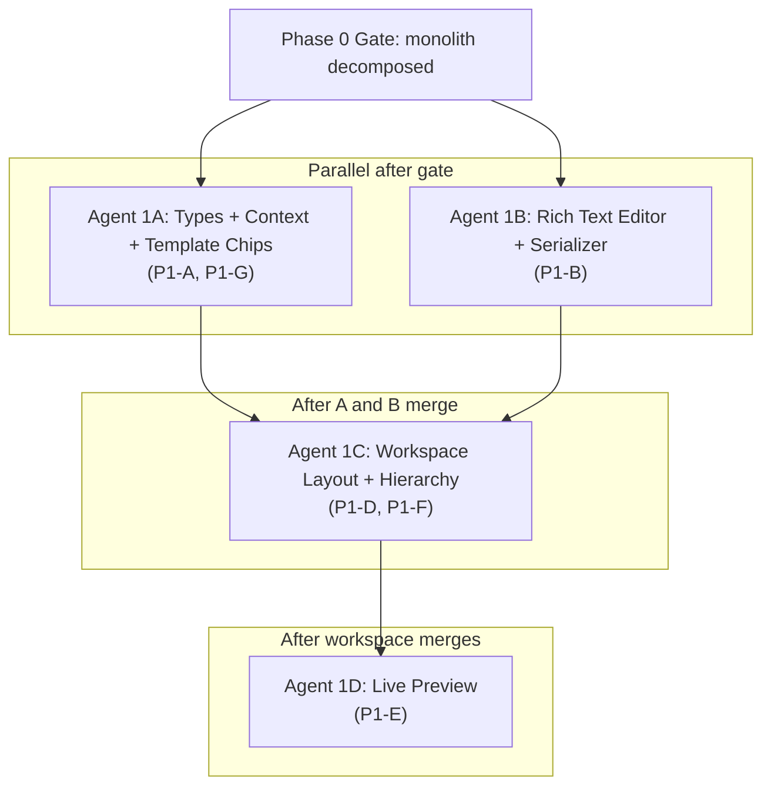

# Document Workspace Upgrade - Full Implementation Plan

## Current State

The document editing experience lives in a single **1,689-line monolith** (`components/projects/project-documents-section.tsx`) that renders a full-screen modal with a flat line grid. The existing PDF generator ([`lib/documents/buildProjectDocumentPdf.ts`](../lib/documents/buildProjectDocumentPdf.ts) -- 867 lines) already produces high-quality output but users type blind with no preview. Line items are flat (`DocumentLineItem` in [`lib/documentTypes.ts`](../lib/documentTypes.ts)) with plain-text descriptions only.

Key infrastructure already in place:
- Revision-based document model via 3 Supabase RPCs (`create_project_document_with_initial_revision`, `append_project_document_revision`, `mark_project_document_revision_exported`)
- `ProjectWorkspaceProvider` context ([`lib/projectWorkspaceContext.tsx`](../lib/projectWorkspaceContext.tsx)) for cross-panel communication
- Calc import from `project_calc_tapes`/`project_calc_lines` via [`lib/calcLines/calcLineImport.ts`](../lib/calcLines/calcLineImport.ts)
- OneDrive file mirror and Supabase Storage for project files
- Capability-gated UI (`canManageDocuments`, `canEditProjects`)

## Architecture Decisions

- **Rich text**: Tiptap (ProseMirror-based), storing as Tiptap JSON in document `meta`. Plain-text `description` field kept as fallback/search index.
- **Resizable panes**: `react-resizable-panels` library for the 3-pane workspace layout.
- **Live preview**: Debounced calls to existing `generateProjectDocumentPdfBuffer`, rendered via `react-pdf` (already a dependency for the Files panel).
- **Hierarchical lines**: `parentId` field on `DocumentLineItem` (stored in meta JSON -- no DB migration needed for line structure).
- **Quote options**: `optionGroupId` on lines + new `OptionGroup` array in meta.
- **Calc sync links**: `calcTapeId`/`calcLineId` on document lines (meta JSON).
- **Image refs**: `imageRef: { fileId, storageKey }` on lines, resolved at PDF render time via existing Supabase Storage signed URLs.

## File Naming Convention

Matches the existing codebase: **kebab-case** for component files (`project-documents-section.tsx`), **camelCase** for hooks/libs (`useProjectDetail.ts`, `projectWorkspaceContext.tsx`). All new files below follow this.

## Phase 0: Decompose the Documents Monolith (Gate)

Before building the workspace, extract coherent modules from the 1,689-line [`components/projects/project-documents-section.tsx`](../components/projects/project-documents-section.tsx). This is a **hard gate** -- Phase 1 cannot start in parallel without it, because every Phase 1 task needs to plug into one of these extracted seams.

**Extract into:**
- `components/projects/documents/documents-list.tsx` -- row list, revision history toggle, row action buttons
- `components/projects/documents/document-editor-modal.tsx` -- the **current** modal, lifted out unchanged (will be replaced by the workspace in P1-D but must work independently first)
- `components/projects/documents/calc-import-dialog.tsx` -- calc tape import flow (already a distinct UI block)
- `components/projects/documents/document-export-modal.tsx` -- export/download/OneDrive flow
- `hooks/useProjectDocuments.ts` -- data fetching (`loadDocs`), CRUD (RPC wrappers), save logic, revision history caching
- Keep `project-documents-section.tsx` as a thin orchestrator (~200-300 lines) that composes these

**Gate criteria:**
- `npm run build` passes
- Manual spot-check: create, edit, preview, print, export (download + OneDrive), revision history toggle all behave identically to before
- No behavior changes -- pure extraction

---

## Phase 1 -- Foundation and Quick Wins

### P1-A: Type Extensions and Workspace Context (foundation, blocks most work)

**Files to modify:**
- [`lib/documentTypes.ts`](../lib/documentTypes.ts) -- extend `DocumentLineItem` with `id: string`, `descriptionRich?: TiptapJSON`, `parentId?: string | null`, `optionGroupId?: string | null`, `calcTapeId?: string | null`, `calcLineId?: string | null`, `imageRef?: { fileId: string; storageKey?: string } | null`
- [`lib/projectWorkspaceContext.tsx`](../lib/projectWorkspaceContext.tsx) -- add `activeDocumentId`, `showPreview: boolean`, `previewZoom: number`, `setActiveDocumentId`, `setShowPreview`, `setPreviewZoom`
- [`lib/documentTypes.ts`](../lib/documentTypes.ts) -- add `TemplateChip` type, `DEFAULT_TEMPLATE_CHIPS` constant
- [`lib/projectDocumentDb.ts`](../lib/projectDocumentDb.ts) -- ensure selects/types accommodate new meta fields

### P1-B: Rich Text Editor Component (independent, can start immediately)

**New files:**
- `components/projects/documents/rich-text-editor.tsx` -- Tiptap editor with toolbar (Bold, Italic, Color presets, Highlight, BulletList, Indent)
- `components/projects/documents/rich-text-toolbar.tsx` -- toolbar UI with Lucide icons matching existing design language
- `lib/documents/richTextSerializer.ts` -- Tiptap JSON to PDF-compatible intermediate format, and Tiptap JSON to plain-text fallback (for `description` search index)
- `lib/documents/richTextSerializer.test.ts` -- unit tests for serialization round-trips

**Dependencies:** `@tiptap/react`, `@tiptap/starter-kit`, `@tiptap/extension-color`, `@tiptap/extension-text-style`, `@tiptap/extension-highlight`, `@tiptap/extension-bullet-list`, `@tiptap/extension-list-item`

### P1-D: Document Workspace Layout (after P1-A and Phase 0)

**New files:**
- `components/projects/documents/document-workspace.tsx` -- 3-pane resizable container using `react-resizable-panels`
- `components/projects/documents/workspace-metadata-pane.tsx` -- left pane: document type selector, vendor, doc number, quote PDF fields, rich-text notes area
- `components/projects/documents/workspace-line-items-pane.tsx` -- center pane: line items editor with drag-drop (`@dnd-kit` already in the project), rich text descriptions
- `components/projects/documents/workspace-preview-pane.tsx` -- right pane: PDF preview container
- `components/projects/documents/line-item-row.tsx` -- single line item row with sub-item nesting

**Integration:**
- `document-workspace.tsx` lives inside the Documents section (not a blocking modal). It is now the default editor path for all users from `project-documents-section.tsx`.
- Opens full-width inside the Documents collapsible when user clicks "New document" or a row "Edit".
- State flows through `useProjectDocuments` hook + workspace context (`activeDocumentId`, `showPreview`, `previewZoom`).

### P1-E: Live Preview Pane (after P1-D)

**New/modified files:**
- `components/projects/documents/workspace-preview-pane.tsx` -- renders PDF via `react-pdf`, DRAFT watermark toggle, zoom slider
- `hooks/useLivePreview.ts` -- debounced (500ms) call to `generateProjectDocumentPdfBuffer`, manages blob URL lifecycle (revokes on change/unmount), loading state
- `lib/documents/buildProjectDocumentPdf.ts` -- **no changes in P1** (preview uses the exact same function)

**Key detail:** The preview calls the PDF function client-side (it already runs in the browser for the existing Preview/Print buttons). No new API route needed.

### P1-F: Hierarchical Line Items (after P1-A, P1-D)

**Modified files:**
- `components/projects/documents/workspace-line-items-pane.tsx` -- "Add Sub-Item" button per row, indentation rendering, parent-child reordering logic (guard against cycles and orphaned children)
- `components/projects/documents/line-item-row.tsx` -- visual nesting (indent level derived from walking the `parentId` chain)
- `lib/documents/buildProjectDocumentPdf.ts` -- render nested items with indentation in PDF output
- `lib/documents/buildProjectDocumentPdf.test.ts` -- snapshot tests for hierarchical rendering
- `lib/documents/richTextSerializer.ts` -- ensure hierarchical items serialize correctly for PDF

### P1-G: Template Chips (after P1-A)

**New files:**
- `components/projects/documents/template-chips.tsx` -- horizontal chip strip in notes area; clicking inserts text at cursor

**Data:** `DEFAULT_TEMPLATE_CHIPS` in `lib/documentTypes.ts` with phrases from the spec (`"THIS QUOTE DOES NOT INCLUDE PAINT"`, `"Materials: A36"`, `"Drawing #Cxxxx Rev X"`, `"NET 30"`, etc.). Stored as `{ label: string; text: string }[]`.

---

## Phase 2 -- Quote Power Features and Calc Two-Way Sync

### P2-A: Quote Options / Alternates (after Phase 1)

**Modified/new files:**
- `lib/documentTypes.ts` -- add `OptionGroup` type (`{ id: string; title: string; lineIds: string[] }`), add `optionGroups?: OptionGroup[]` to `ProjectDocumentDraftMeta`
- `components/projects/documents/workspace-line-items-pane.tsx` -- "Add Quote Option" button, collapsible option group sections with headers and subtotals
- `components/projects/documents/option-group-header.tsx` -- new component for option group title/controls
- `lib/documents/buildProjectDocumentPdf.ts` -- option group rendering (separate boxes or "Customer to select" language), grouped subtotals
- `lib/documents/composePdfInput.ts` -- pass option group structure through to PDF layout

### P2-B: Inline Image / Figure Support (after Phase 1)

**New/modified files:**
- `components/projects/documents/image-insert-picker.tsx` -- file browser filtered to images, reuses Files panel's folder/file data structures
- `components/projects/documents/rich-text-toolbar.tsx` -- add "Insert Reference Pic" button
- `lib/documents/buildProjectDocumentPdf.ts` -- image embedding (resolve `imageRef.storageKey` to signed URL or base64 at render time, embed at constrained size)
- `components/projects/documents/line-item-row.tsx` -- thumbnail display for attached images

**Size guard:** Enforce a max image dimension (e.g., 2MB / 2000px) in the picker; reject larger images with a clear message ("Use Files panel to attach full drawings").

### P2-C: Two-Way Calc Sync (partially independent, can start during Phase 1)

**New files:**
- `lib/documents/calcDocumentSync.ts` -- sync service:
  - `pushDocumentChangesToCalc(documentLines, tapeId)` -- update calc tape from doc edits
  - `refreshDocumentFromCalc(tapeId, documentLines)` -- pull calc changes into doc
  - `detectSyncConflicts(docLines, calcLines)` -- compare linked lines
- `lib/documents/calcDocumentSync.test.ts` -- unit tests for conflict detection and merge rules
- `components/projects/documents/calc-sync-drawer.tsx` -- collapsible "Calc Tools" drawer/tab in workspace
  - Enhanced import preview (shows exactly how lines map)
  - "Push Changes to Calc" action with confirmation
  - Sync status indicators per linked line

**Modified files:**
- `components/projects/documents/line-item-row.tsx` -- calc link indicator icon
- `lib/projectWorkspaceContext.tsx` -- add `linkedCalcTapeIds` set for tracking active links
- Existing `calc-import-dialog.tsx` -- enhanced with live mapping preview

### P2-D: Attention Formatting and Snippets (after P1-B)

**Modified/new files:**
- `components/projects/documents/rich-text-editor.tsx` -- full color picker + highlight colors (beyond Phase 1 presets)
- `components/projects/documents/snippet-library.tsx` -- searchable user-saved snippet panel
- `lib/documents/snippets.ts` -- snippet CRUD. **Start with localStorage** (per-user, per-browser); promote to DB later if multi-device sharing is requested.
- `components/projects/documents/rich-text-toolbar.tsx` -- snippet insert button

### P2-E: Rich Editor for All Document Types (after Phase 1)

Largely inherited from Phase 1 since the editor is built as a shared component. This task ensures:
- RFQ, PO, Packing List, BOL, Invoice all use the same line items pane + rich text editor
- Vendor dropdown and PO-specific fields remain in the metadata pane (conditional on `kind`)
- PDF renderer handles rich text for all document types (not just quotes) -- verify per-kind snapshot tests

---

## Phase 3 -- Polish, Workflow Glue, and Edge Cases

### P3-A: Full Bi-Directional Click Navigation

- Preview click resolves to line item ID via PDF coordinate mapping
- Editor line focus scrolls preview to corresponding rendered area
- Requires adding anchor IDs or coordinate metadata to PDF generation output

### P3-B: Improved Totals and Option Rendering

- Exact match to Nucor quote style in PDF
- Grouped lead times per option
- Separate subtotals per option group
- Grand total with/without options toggle

### P3-C: Job Packet Quick Action

**New files:**
- `components/projects/documents/job-packet-builder.tsx` -- UI for selecting documents + CAD files to include
- `lib/documents/buildJobPacket.ts` -- aggregator that pulls from `project_documents` + `project_files`, generates cover page + TOC, concatenates PDFs (use `pdf-lib` for merging since `@react-pdf/renderer` alone can't merge arbitrary pre-existing PDFs)
- Button in Documents section header: "Build Job Packet"

**New dependency:** `pdf-lib` (for PDF merging) -- unavoidable for combining existing PDF files with newly rendered pages.

### P3-D: Keyboard Shortcuts and Undo

- Cmd/Ctrl+Z undo in Tiptap (built-in) + line-level undo for structural changes
- Arrow key navigation between lines
- Tab/Shift+Tab for indent/outdent
- Escape to close workspace

### P3-E: Validation and Smart Defaults

- Warn on missing lead time, shipping method, contact
- Auto-suggest from project record and CRM data
- Highlight when line total exceeds stored budgetary number
- Visual indicators in metadata pane

### P3-F: Mobile-Responsive Fallback

- Single-column stacked view when viewport < `xl` breakpoint
- Preview becomes a toggle/tab instead of persistent pane
- Touch-friendly controls for shop tablets

---

## Multi-Agent Execution Strategy

The work naturally splits into parallel streams. Each agent should operate on its own **git worktree/branch** and land via PR to keep blast radius contained.

### Phase 0 (1 agent, serial gate)

- **Agent 0**: Decompose the documents monolith. Must land and be build-green before any Phase 1 parallel work begins.

### Phase 1 Agents (4 parallel after gate)

- **Agents 1A and 1B** start in parallel after Phase 0 merges
- **Agent 1C** starts after both 1A and 1B merge
- **Agent 1D** starts after 1C merges

### Phase 2 Agents (up to 4 parallel)

- **Agent 2A**: Quote Options system (P2-A) -- starts once Phase 1 workspace is stable
- **Agent 2B**: Inline Images + File Picker (P2-B) -- independent, can start with 2A
- **Agent 2C**: Two-Way Calc Sync service + drawer (P2-C) -- can start during late Phase 1 since sync service is pure TS
- **Agent 2D**: Attention Formatting + Snippets + all-type parity (P2-D, P2-E) -- needs editor from Phase 1

### Phase 3 Agents (up to 4 parallel)

- **Agent 3A**: Job Packet builder (P3-C) -- largest P3 task, start first
- **Agent 3B**: Bi-directional navigation + keyboard shortcuts (P3-A, P3-D)
- **Agent 3C**: Validation, smart defaults, mobile responsive (P3-E, P3-F)
- **Agent 3D**: Totals/option rendering polish (P3-B) -- after P2-A options merge

### Coordination Rules

- Each agent starts by reading this plan and the referenced AGENTS.md
- Branch naming: `doc-workspace/p{phase}-{letter}-{short-slug}` (e.g., `doc-workspace/p1-b-rich-text-editor`)
- PRs land into a shared integration branch (`doc-workspace/main`) rather than direct to `main` until Phase 1 is complete; then merge to `main` as a single Phase 1 release
- Every agent runs the verification checklist before declaring done

---

## Rollout Strategy

- **Global rollout completed**: The workspace editor path is now live for all users by default from `project-documents-section.tsx`.
- **No DB migrations in Phase 1**: All new fields live in the existing `project_documents.metadata` JSONB column.
- **Post-cutover cleanup**: remove dead fallback artifacts (`workspaceFeatureFlag` helper/tests and any unused modal-only code paths) once any final rollback window closes.

---

## New Dependencies

| Package | Used by | Phase |
|---------|---------|-------|
| `@tiptap/react` + `@tiptap/starter-kit` + `@tiptap/extension-color` + `@tiptap/extension-text-style` + `@tiptap/extension-highlight` | Rich text editor | Phase 1 |
| `react-resizable-panels` | Workspace 3-pane layout | Phase 1 |
| `pdf-lib` | Job Packet PDF merging | Phase 3 |

Already in project: `react-pdf`, `pdfjs-dist`, `@dnd-kit/*` -- no new additions needed for those.

---

## Verification Strategy

Per [AGENTS.md](../AGENTS.md), every phase gate requires:

- `npm run build` (clean build)
- `npm run lint` (no new warnings in changed files)
- Unit tests for all new pure-TS modules (serializer, calc sync, job packet builder)
- PDF snapshot regression: generate one quote per kind, compare to a committed baseline (the current output)
- Manual spot-check:
  - Create a quote in the new workspace, add hierarchical lines + rich text, preview updates live
  - Export to OneDrive, verify PDF in `_DOCS` folder matches preview
  - Revision history still works, "Use as reference" still restores financials
  - Existing documents (no `descriptionRich`) still render identically

If **any schema change** is added (not expected until Phase 2-C if we choose DB-backed calc links):
- `npm run security:db-schema-guard`
- `npm run test:rbac-api-guards`
- `npm run test:rbac-sql`
- `npm run supabase:migration:list:linked`

## Risk Mitigations

- **PDF regression**: Phase 1 preview uses the exact current generator -- zero layout changes until P1-F adds hierarchy support (additive only)
- **Rich text perf**: Tiptap is lightweight; rich text limited to description field, not pricing math
- **Monolith decomposition risk**: Extract-and-wire approach preserves all existing behavior; no logic rewrites during decomposition
- **Two-way sync conflicts**: Last writer wins with toast notification; revision history (already exists) provides recovery
- **Backward compatibility**: `descriptionRich` is optional; existing documents with plain `description` continue to work unchanged
